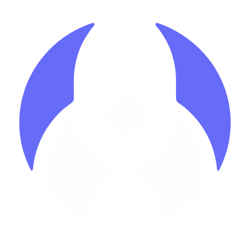
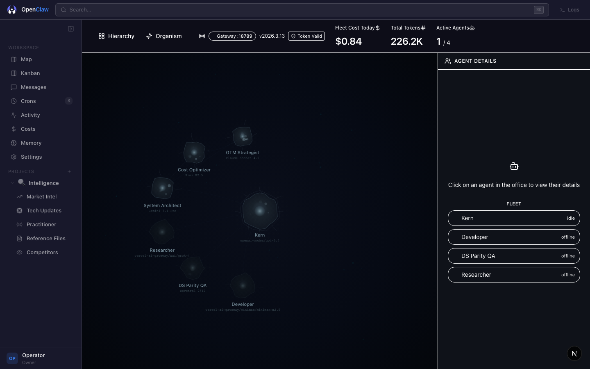
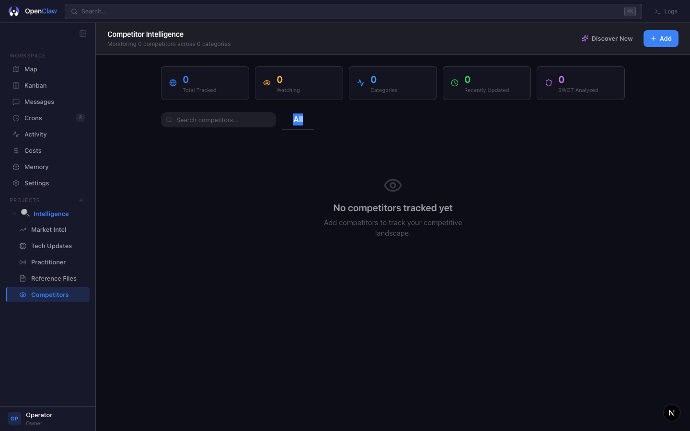
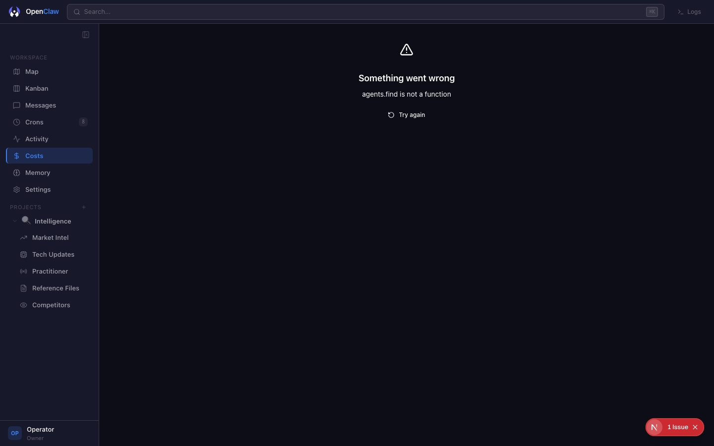
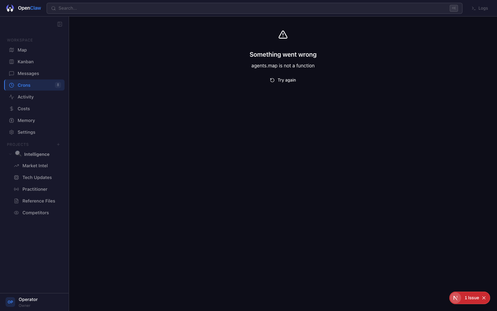
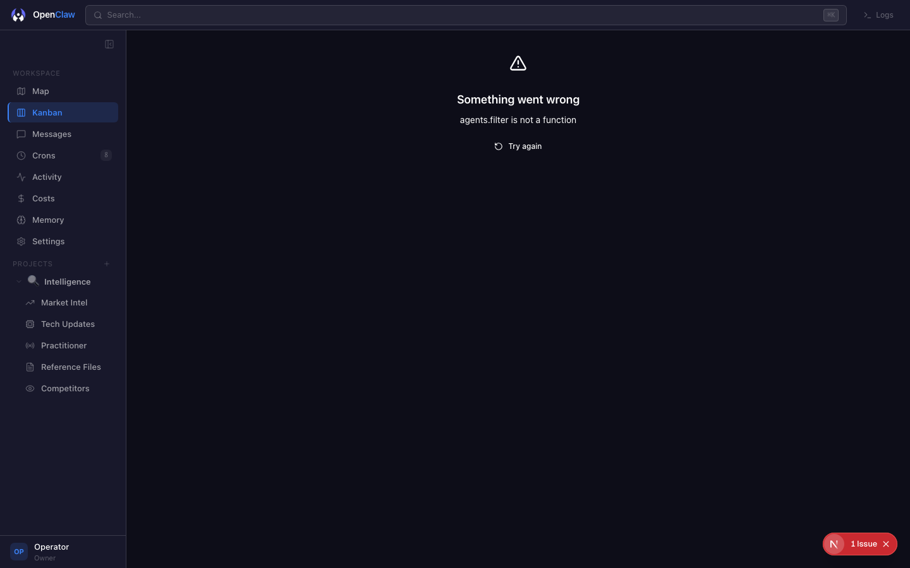
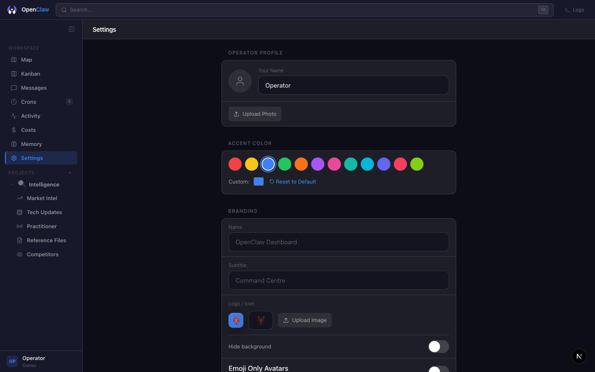
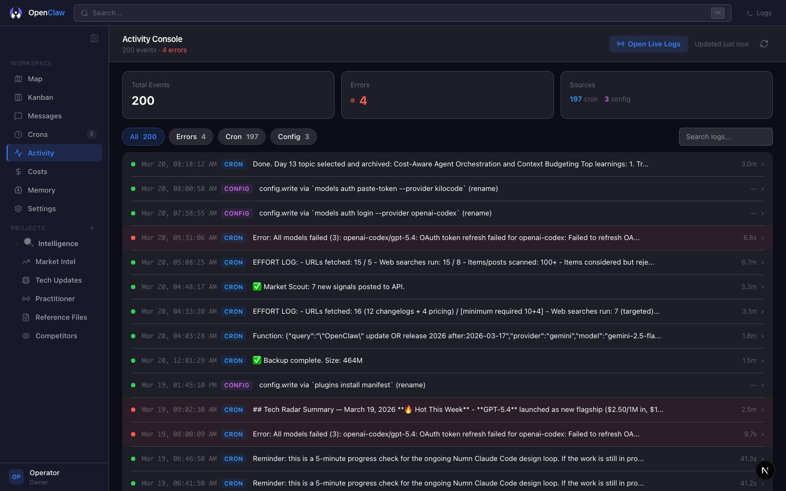
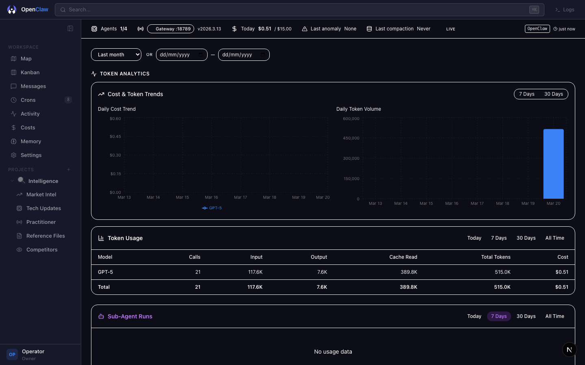

<p align="center">
  
</p>

<h1 align="center">OpenClaw Dashboard</h1>

<p align="center">
  <strong>The Command Centre for AI Agent Fleets</strong>
</p>

<p align="center">
  Monitor, manage, and optimize every agent in your fleet from a single pane of glass.<br/>
  Cost analytics &middot; Competitor intelligence &middot; Memory health &middot; Cron pipelines &middot; Kanban workflows &middot; Interactive chat.<br/>
  <strong>100% local-first. Zero cloud dependency. Your data never leaves your machine.</strong>
</p>

<p align="center">
  <a href="LICENSE"></a>
  <a href="https://nextjs.org"></a>
  <a href="https://react.dev"></a>
  <a href="https://typescriptlang.org"></a>
  <a href="https://tailwindcss.com"></a>
</p>

---

## What is OpenClaw Dashboard?

Running AI agents at scale means juggling costs, context windows, memory drift, competitor landscapes, and coordination across dozens of autonomous processes. **OpenClaw Dashboard** gives you a single local-first command centre that reads directly from your [OpenClaw](https://openclaw.ai) installation -- no cloud dependency, no telemetry, full control.

> **New in v2.0** -- 10-step onboarding wizard, project workspaces with competitor scanning, market intelligence feeds, practitioner signal aggregation, visual cron pipeline builder, memory health AI analysis, and a complete Apple-inspired glass design system.

---

## Features

### Agent Fleet Monitoring
Real-time monitoring of multi-agent systems with constellation graph visualization, execution traces, context health bars, and drift detection. Four home views -- **Org Map, Grid, Feed, and Constellation** -- let you choose how to observe your fleet.



### Competitor Intelligence
Discover, track, and profile competitors across your market. Add competitors manually or let AI discover them. Drill into per-competitor detail pages with SWOT analysis, update tracking, and category organization.



### Cost Analytics
Per-agent and per-provider spend attribution with token-level granularity. Optimization scoring, cache savings estimation, anomaly detection, week-over-week trending, and per-model breakdowns.



### Cron Pipeline Builder
Visual DAG editor for job dependencies powered by @xyflow/react. Track execution history with cost attribution, configure delivery rules, and build dependency chains between scheduled tasks.



### Interactive Agent Chat
Real-time SSE streaming chat with multimodal support. Upload images, review per-agent conversation history, and use slash commands (`/help`, `/status`, `/cost`) to query your fleet.

### Kanban Board
Full agile project management with columns (todo / in-progress / done / blocked), agent assignment, priority labels, ticket chat threads, and automation rules.



### Memory Health Monitor
AI-driven analysis of agent memory with staleness detection, completeness checks, editing hints, and one-click reindex controls. Know when an agent's context is drifting before it causes problems.

### Market Intelligence
Automated competitive intelligence feeds with signal categorization. Your agents scan the market and surface trends, competitor moves, and technology shifts.

### Practitioner Signals
Community signal aggregation from Reddit, forums, and social media. Surface pain points, feature requests, and positive signals from real practitioners in your domain.

### Tech Updates Radar
Curated technology radar with category filtering. Stay on top of framework releases, AI model updates, and tooling changes relevant to your stack.

### Project Workspaces
Organize your intelligence feeds, competitors, and reference files into named projects. Each project gets its own icon, description, and URL. Create, edit, and delete projects from the sidebar.

### Settings & Customization
Full UI for accent color, portal branding (name, subtitle, logo), agent avatars, operator profile, and theme customization. 12 accent color presets + custom color picker.



### And More

| Feature | Description |
|---------|-------------|
| **10-Step Onboarding Wizard** | Guided setup with auto-detection, gateway testing, agent discovery, and feature selection |
| **Global Search** | Unified search across agents, crons, memory, costs, and all data types (Cmd+K) |
| **Live Stream Widget** | Real-time activity log panel accessible from any page |
| **Agent Detail Pages** | Per-agent view with SOUL.md personality viewer and conversation history |
| **Activity Console** | Browseable logs with filtering by source (cron, config, error) |
| **Security Posture** | Device auditing, key rotation reminders, configuration change tracking |
| **Reference Files** | Document storage with TipTap rich text editor, tags, and full-text search |
| **Dynamic Favicon** | Theme-aware favicon that switches between light/dark based on system preference |
| **Voice Features** | Text-to-speech (ElevenLabs) and speech-to-text transcription |
| **Design System QA** | Component-level fidelity scoring and token reuse tracking |
| **Release Tracker** | Version history and deployment notes |
| **Docker Support** | Production-ready multi-stage Dockerfile with docker-compose |

---

## Screenshots

| View | Preview |
|------|---------|
| Agent Fleet |  |
| Competitor Intelligence |  |
| Settings |  |
| Cron Pipelines |  |
| Activity Log |  |
| Security |  |

---

## Quick Start

### Prerequisites

- **Node.js 20+** (LTS recommended)
- **npm 10+** or equivalent package manager
- [OpenClaw](https://openclaw.ai) installed locally (provides agent session data)

### Installation

```bash
# Clone the repository
git clone https://github.com/ChristianAlmurr/openclaw-dashboard
cd openclaw-dashboard

# Install dependencies
npm install

# Configure environment
cp .env.local.example .env.local
# Edit .env.local with your paths (see Environment Variables below)

# Start the development server
npm run dev
```

Open [http://localhost:3333](http://localhost:3333) in your browser. The **10-step onboarding wizard** will guide you through initial configuration on first launch.

### Available Scripts

| Command | Description |
|---------|-------------|
| `npm run dev` | Start development server on port 3333 |
| `npm run build` | Create production build |
| `npm start` | Start production server on port 3333 |
| `npm run lint` | Run ESLint |
| `npm test` | Run Vitest test suite |

---

## Docker Deployment

### Using Docker Compose (recommended)

```bash
docker compose up -d
docker compose logs -f mission-control
```

### Using Docker directly

```bash
docker build -t openclaw-dashboard .
docker run -d \
  --name openclaw-dashboard \
  -p 3333:3333 \
  -v ~/.openclaw-dashboard:/data/db \
  -v ~/.openclaw:/data/openclaw:ro \
  -e OPENCLAW_HOME=/data/openclaw \
  -e DATA_DIR=/data/db \
  openclaw-dashboard
```

---

## Environment Variables

Copy `.env.local.example` to `.env.local` and configure:

| Variable | Default | Description |
|----------|---------|-------------|
| `OPENCLAW_HOME` | `~/.openclaw` | Path to your OpenClaw data directory |
| `WORKSPACE_PATH` | `~/.openclaw/workspace` | Path to your agent workspace |
| `OPENCLAW_BIN` | Auto-detected | Path to the OpenClaw CLI binary |
| `OPENCLAW_GATEWAY_TOKEN` | Auto-detected | Gateway authentication token |
| `OPENCLAW_GATEWAY_PORT` | `18789` | Gateway HTTP port |
| `PROJECT_REPO_PATH` | -- | Project repository path (enables task/sprint parsing) |
| `DATA_DIR` | `~/.openclaw-dashboard` | SQLite database directory |
| `GITHUB_PAT` | -- | GitHub personal access token for private repos |

---

## Architecture

### Tech Stack

| Layer | Technologies |
|-------|-------------|
| **Frontend** | Next.js 16, React 19, TypeScript 5.9, Tailwind CSS 4 |
| **State** | TanStack React Query v5, Zustand, React Context |
| **UI** | Radix UI, Lucide React, Recharts v3, @xyflow/react, TipTap |
| **Backend** | Next.js API Routes (52 endpoints), SSE streams |
| **Database** | SQLite via better-sqlite3 |
| **Scheduling** | node-cron, Chokidar file watchers |
| **Integrations** | OpenAI SDK, simple-git, ElevenLabs |
| **Testing** | Vitest, React Testing Library |

### Data Flow

```
~/.openclaw/                     Agent sessions, gateway logs, config
    |
    v
[Parsers & Watchers]             Real-time log watchers + session parsers
    |
    v
[SQLite Database]                Local persistence (zero cloud dependency)
    |
    v
[Next.js API Routes]             52 REST endpoints + SSE streams
    |
    v
[React Frontend]                 React Query -> Zustand -> Apple glass UI
```

---

## Configuration

### Onboarding Wizard

On first launch, the 10-step wizard walks you through:

1. **Welcome** -- Product overview
2. **Prerequisites** -- Auto-detect Node.js, CLI, workspace, gateway
3. **Workspace** -- Configure data directory
4. **Gateway** -- Test connectivity
5. **Agent Discovery** -- Scan and display your agents
6. **Features** -- Toggle modules (fleet, chat, kanban, crons, memory, costs, etc.)
7. **Appearance** -- Name, accent color, branding
8. **Notifications** -- Cost alerts, key rotation reminders
9. **Integrations** -- GitHub, optional webhooks
10. **Tour** -- Feature walkthrough

Re-run anytime from Settings or `/setup`.

### Theming

Apple-inspired glass aesthetic with full accent color customization. 12 presets + custom color picker. Design tokens defined as CSS custom properties in the Tailwind v4 `@theme` layer.

---

## Testing

```bash
npm test              # Run all tests
npx vitest            # Watch mode
npx vitest --coverage # With coverage
```

---

## Contributing

We welcome contributions. See [CONTRIBUTING.md](CONTRIBUTING.md) for development setup, coding standards, and pull request guidelines.

---

## License

[MIT](LICENSE) -- Copyright (c) 2026 OpenClaw Contributors
