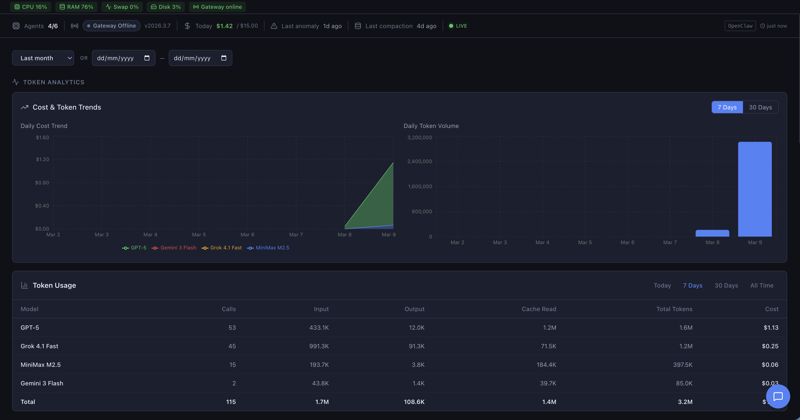
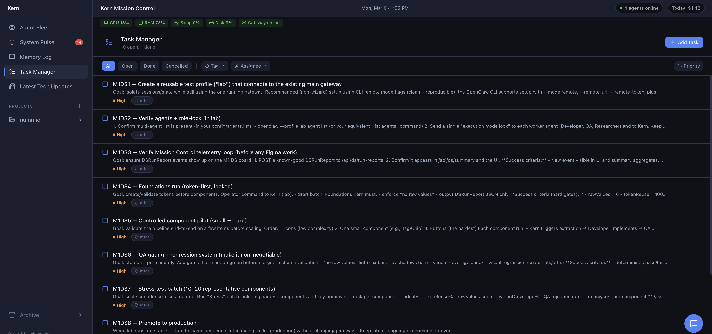
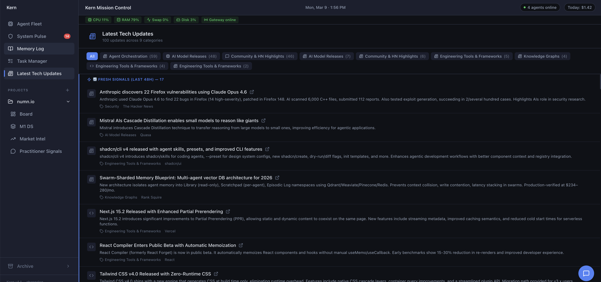
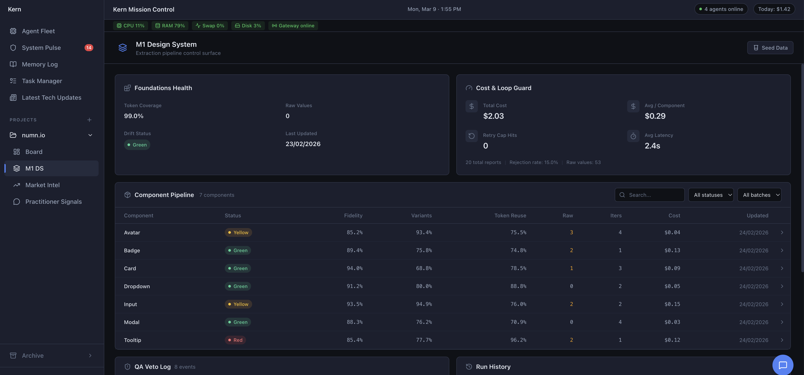

# OpenClaw Dashboard — Mission Control

[](LICENSE)
[](https://nextjs.org)
[](https://typescriptlang.org)

A local-first mission control dashboard for monitoring and managing AI agent fleets. Track costs, performance, context health, security posture, and market intelligence — all from a single dark-themed interface.


## Features

### Agent Fleet
Real-time monitoring of multi-agent systems with constellation graph visualization, execution traces, context health, and drift detection.


### Cost Tracking
Per-agent and per-provider spend attribution with 24h/7d/30d breakdowns, hourly charts, and anomaly detection.


### System Pulse
Security posture monitoring: device tokens, OAuth status, FileVault, git hooks, config audit trail.



### Task Manager
Sprint tracking with agent assignment, priority sorting, and status management.



### Tech Updates
Curated technology radar with category filtering.



### Design System QA
Component-level fidelity scoring, token reuse tracking, and visual diff reporting.



### And More
- **Memory Log** — Browse agent session summaries, decisions, notes, and alerts with full-text search
- **Market Intel** — Competitive intelligence feed with signal categorization and relevance scoring
- **Practitioner Signals** — Community signal aggregation from Reddit, forums, and social platforms
- **Daily Brief** — AI-generated daily digest connecting signals to project relevance

## Architecture

```
Next.js 14 (App Router)
├── SQLite (better-sqlite3) — local database for all persistent data
├── OpenClaw data dir (~/.openclaw) — reads agent sessions, gateway logs, config
├── SSE streams — real-time agent and system updates
├── React Query — data fetching with stale-time caching
├── Zustand — client state management
├── Recharts — cost and performance visualizations
└── Tailwind CSS — dark theme with design tokens
```

The dashboard is **read-heavy by design** — it reads from your local OpenClaw installation and stores its own metadata in a SQLite database. Cron jobs can optionally write market intel and tech updates via API routes.

## Quick Start

### Prerequisites

- Node.js 18+
- [OpenClaw](https://openclaw.ai) installed locally (provides agent session data)

### Setup

```bash
# Clone the repository
git clone https://github.com/ChristianAlmurr/openclaw-dashboard)
cd openclaw-dashboard

# Install dependencies
npm install

# Configure environment
cp .env.local.example .env.local
# Edit .env.local with your paths (see Configuration below)

# Start the dev server
npm run dev
```

Open [http://localhost:3333](http://localhost:3333) — the setup wizard will guide you through initial configuration.

### Docker

```bash
# Build and run with Docker Compose
docker compose up -d
```

Edit `docker-compose.yml` to map your local volumes:
- `~/.openclaw-dashboard` — SQLite database
- `~/.openclaw` — OpenClaw agent data (read-only)
- `~/my-project` — Your project repo (read-only, optional)

## Configuration

### Environment Variables

| Variable | Default | Description |
|----------|---------|-------------|
| `OPENCLAW_HOME` | `~/.openclaw` | OpenClaw data directory |
| `PROJECT_REPO_PATH` | — | Path to your project repo (enables sprint/task parsing) |
| `DATA_DIR` | `~/.openclaw-dashboard` | SQLite database directory |
| `GITHUB_PAT` | — | GitHub token for private repo sync |

### Setup Wizard

On first launch, the setup wizard (`/setup`) configures:
1. OpenClaw data directory path
2. Project repository path
3. GitHub repository (optional)
4. Daily spend alert threshold
5. API key rotation reminder interval
6. UI accent color

## Project Structure

```
app/                    # Next.js App Router pages and API routes
  api/                  # REST API endpoints
  fleet/                # Agent Fleet page
  market-intel/         # Market Intelligence page
  setup/                # Setup wizard
  ...
components/
  fleet/                # Agent detail, execution trace, constellation graph
  nav/                  # Sidebar navigation
  ...
hooks/                  # React Query hooks and SSE streams
lib/
  db/                   # SQLite schema, migrations, and queries
  parsers/              # OpenClaw log parsers, session cost extraction
  jobs/                 # Cron jobs (market news, tech radar, researcher)
scripts/                # Utility scripts (DB hardening, backfill)
store/                  # Zustand stores
types/                  # TypeScript type definitions
```

## API Routes

| Endpoint | Method | Description |
|----------|--------|-------------|
| `/api/agents` | GET | Agent fleet data with real-time metrics |
| `/api/agents/graph` | GET | Constellation graph (nodes + edges) |
| `/api/cost` | GET | Cost snapshot with provider/agent breakdowns |
| `/api/security` | GET | Security posture and alerts |
| `/api/memory` | GET/POST | Memory log entries |
| `/api/market-intel` | GET/POST | Market intelligence signals |
| `/api/tech-updates` | GET/POST | Technology radar updates |
| `/api/config` | GET/POST | Dashboard configuration |
| `/api/stream` | GET | SSE stream for real-time updates |

## Contributing

See [CONTRIBUTING.md](CONTRIBUTING.md) for development setup and pull request guidelines.

## License

[MIT](LICENSE)
